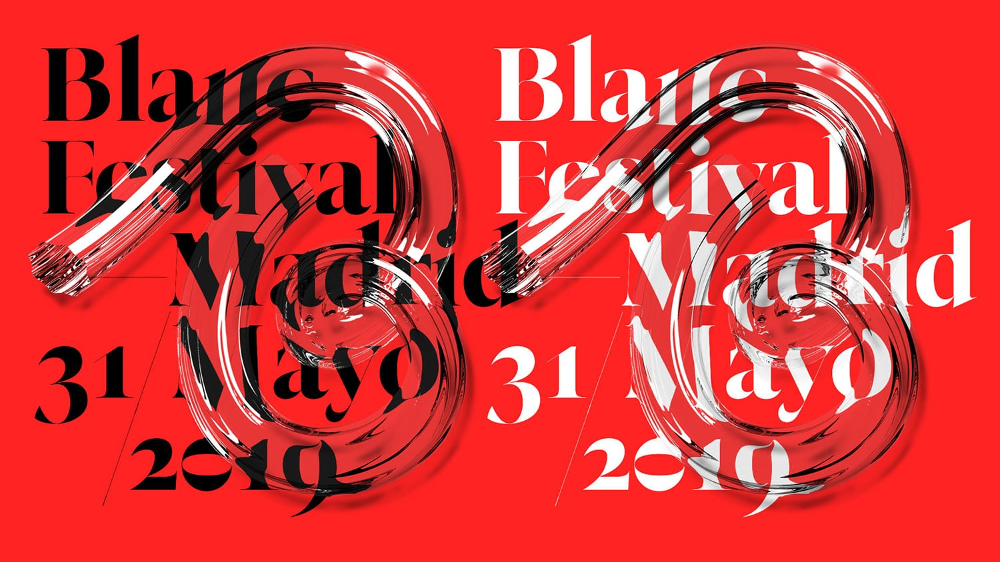
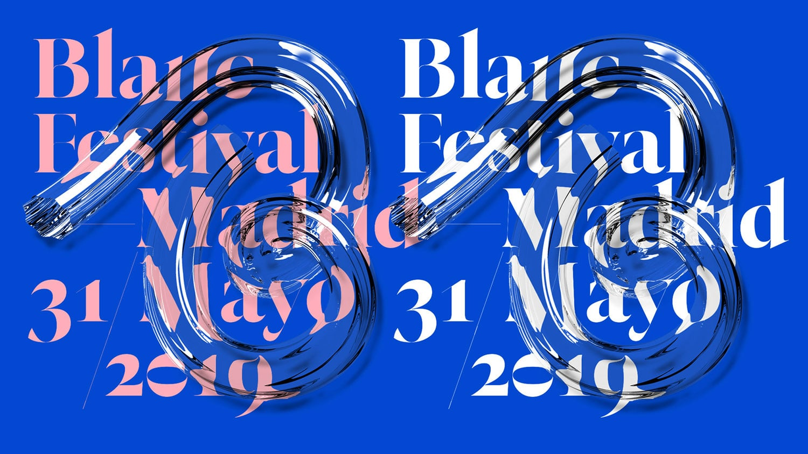
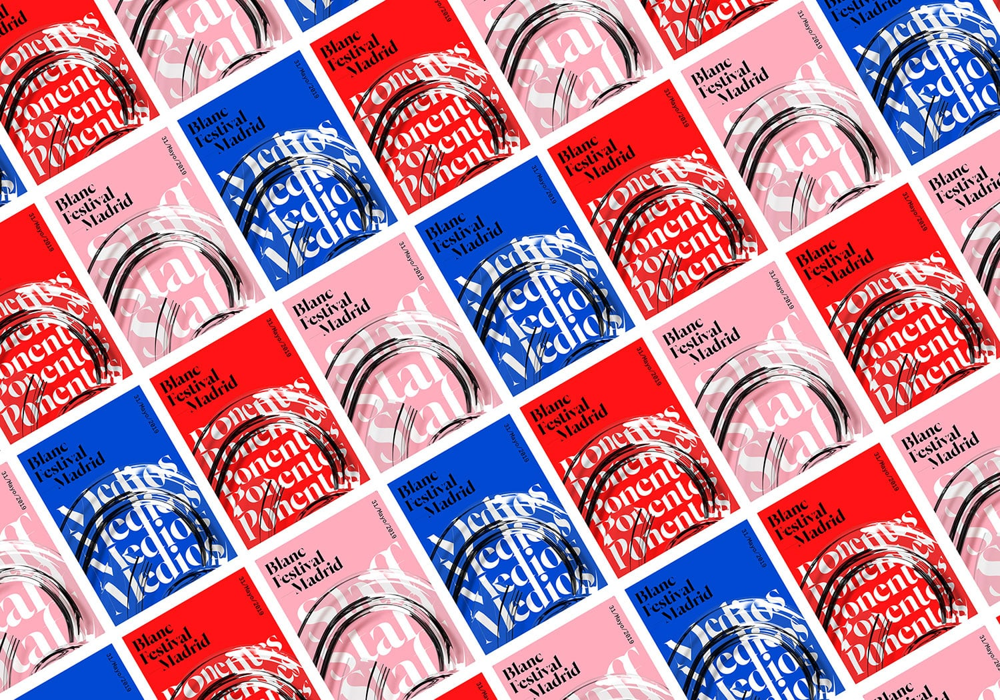
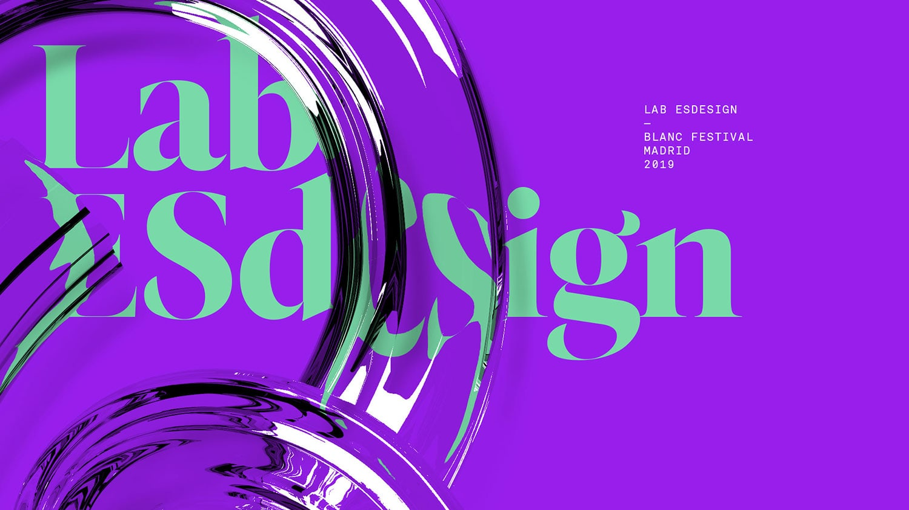
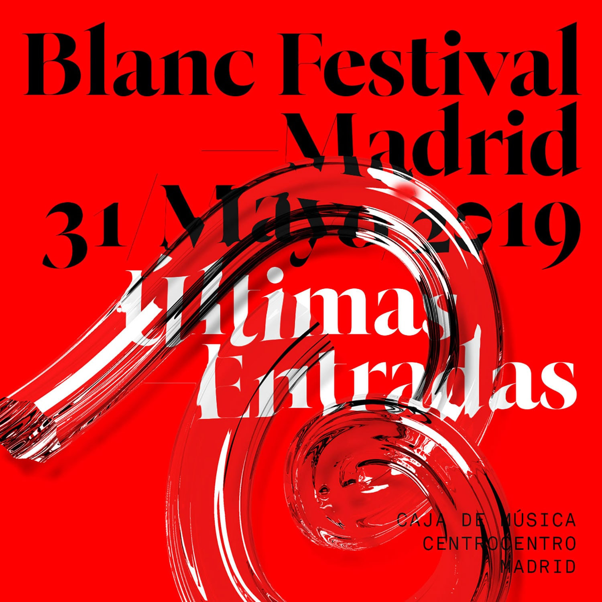
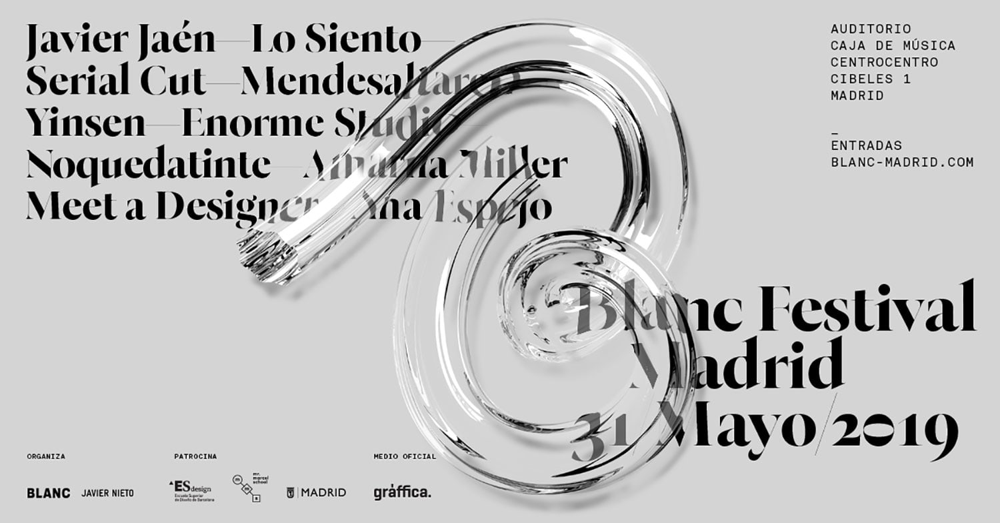
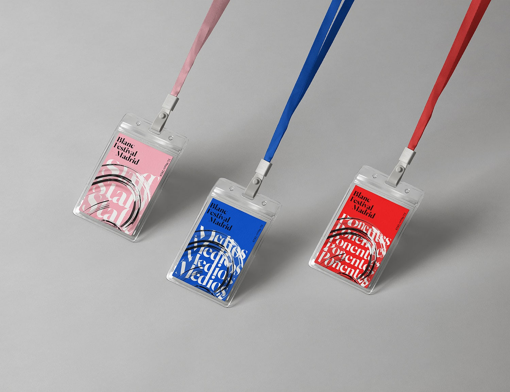
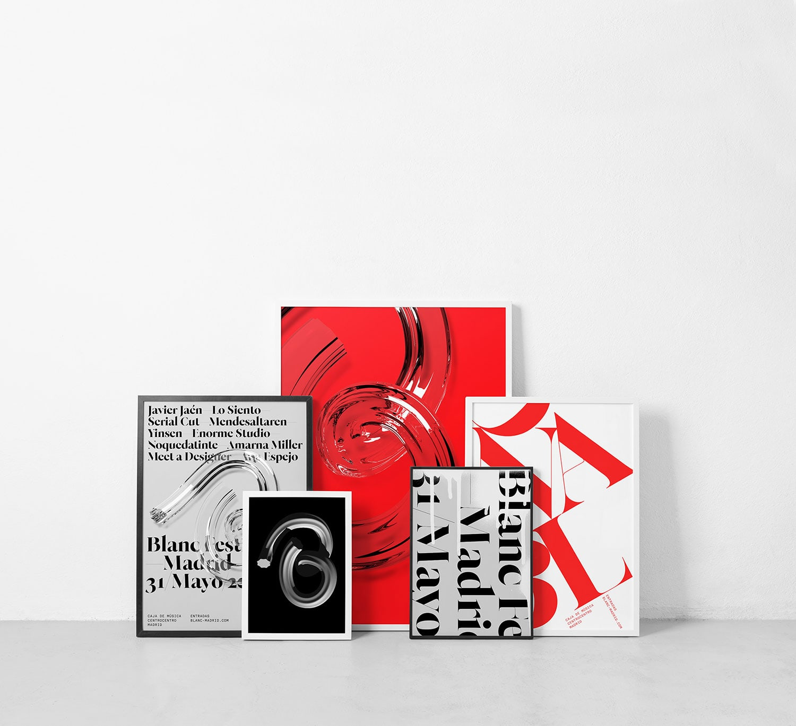
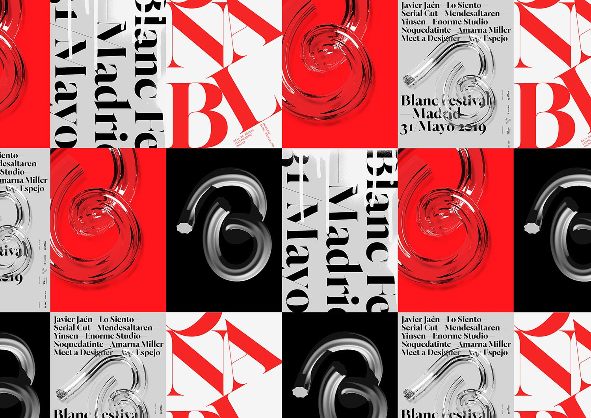

Quim Marin & Stupendous Studio designed the identity for Blanc Festival. It was born in 2009, but its gestation dates back to 2003, coinciding with the Year of Design in Barcelona. Octubre del Disseny was, without knowing it yet, the embryonic phase of a festival that since then has not stopped growing up. Three days with talks, masterclasses and activities around design and professional creativity, with the focus on emerging talent and recognition of the great masters and pioneers of design in our country.

And if there is something that characterizes Blanc, it is the closeness, the familiar and comradeship environment, and the playful/festive atmosphere that is breathed during the three days of celebration of the event.

