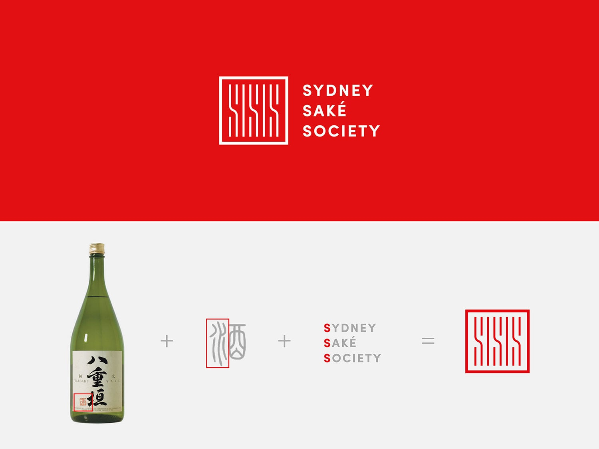
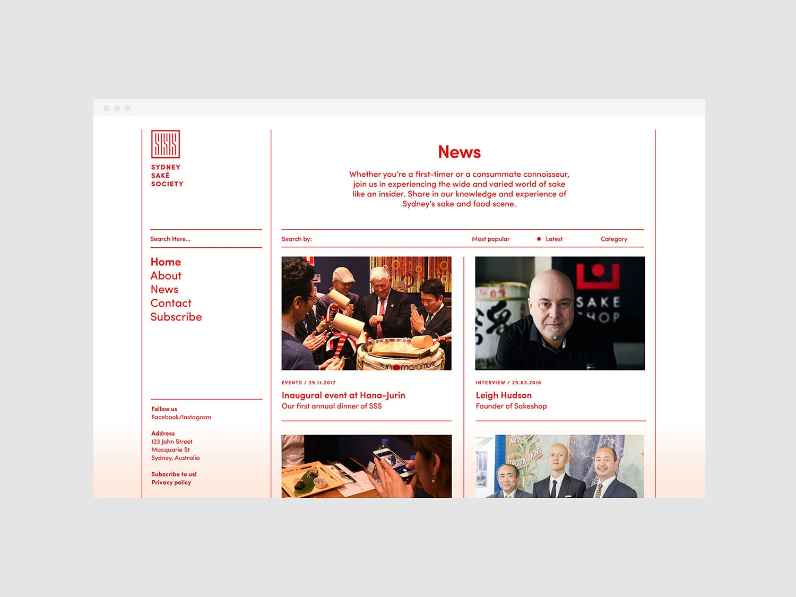
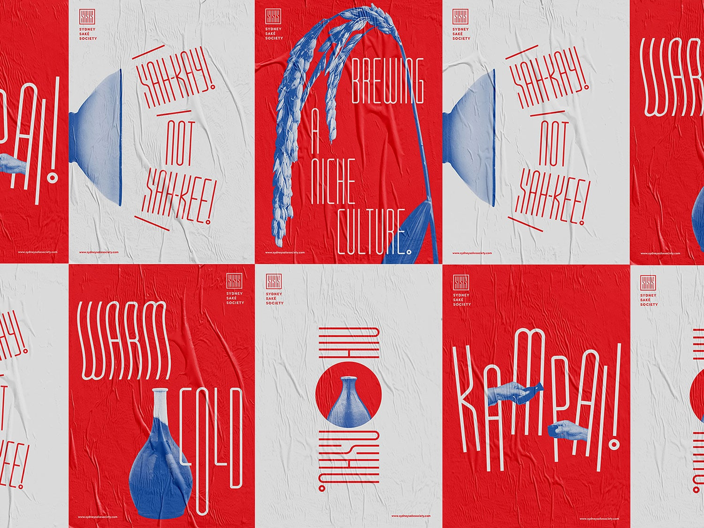
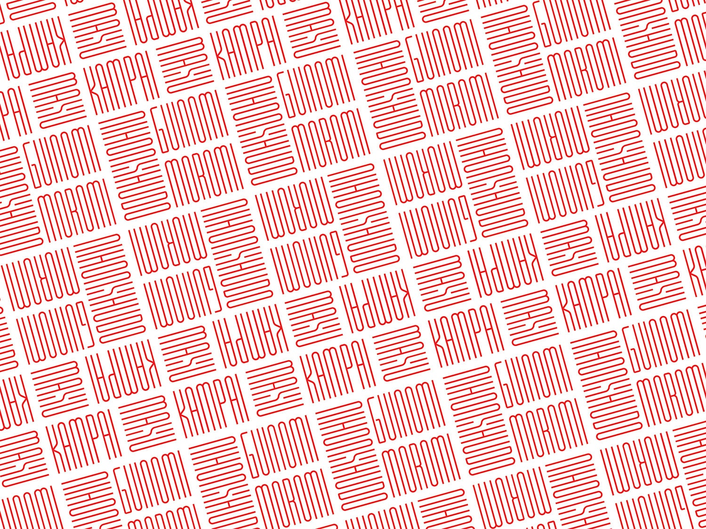
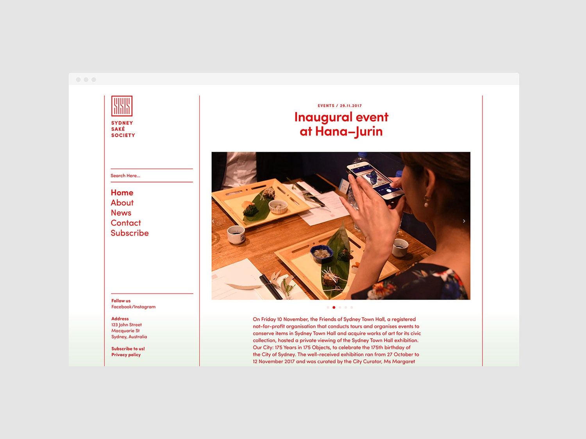
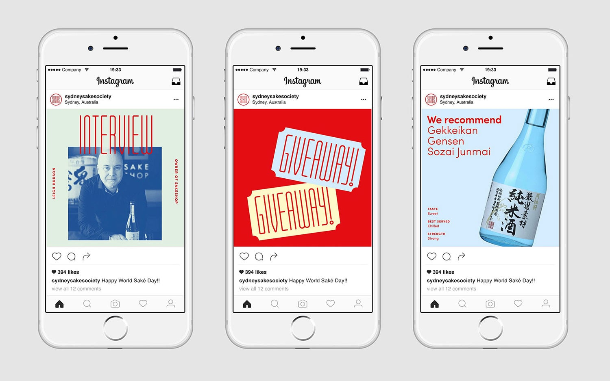
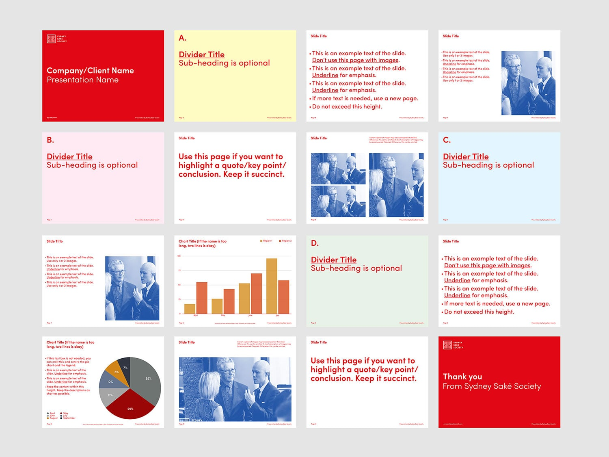
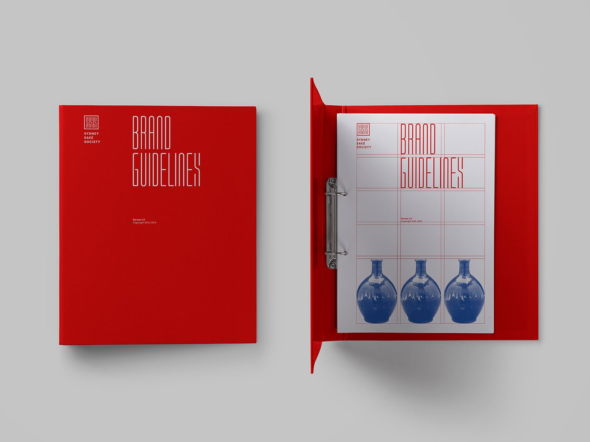
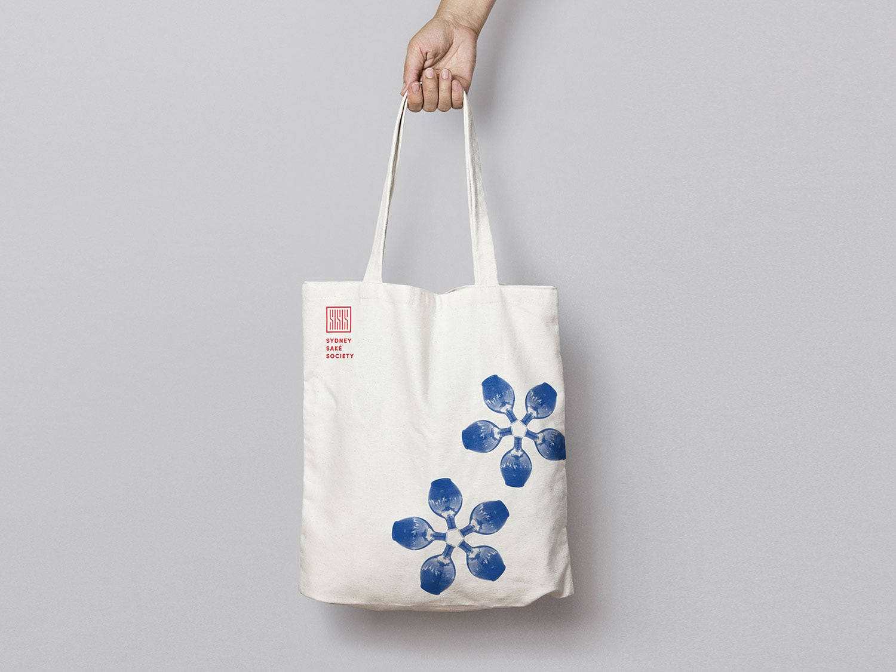
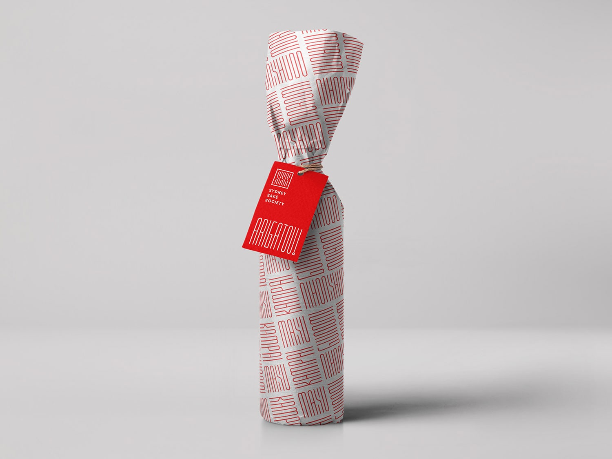

Kevin Teh designed Sydney Saké Society – A brand identity project for a saké organisation in Sydney. As an organisation that aims to bridge the gap between the niche saké culture and Sydney’s vibrant food and entertainment scene, Sydney Saké Society needs a modern, non-cliché and Western-friendly Japanese image.

With this approach in mind, the omission of Japanese characters and traditional Japanese aesthetics (e.g. brush strokes and washi paper) forms the basis of the design direction.

